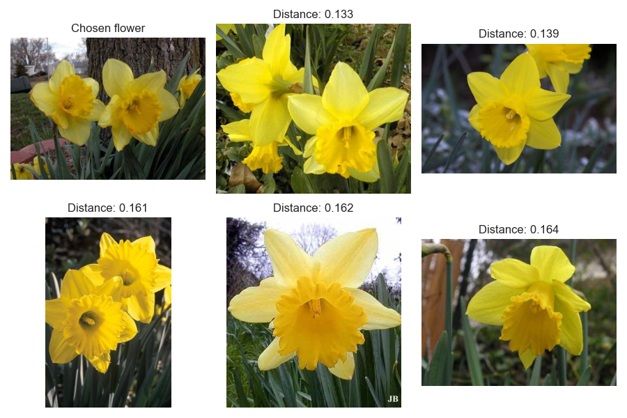

# Visual analytics assignment 1
This repository is assignment 1 out of 4, to be sumbitted for the exam of the university course [Visual Analytics](https://kursuskatalog.au.dk/en/course/115695/Visual-Analytics) at Aarhus Univeristy.

The first section describes the assignment task as defined by the course instructor. The section __Student edit__ is the student's description of how the repository solves the task and how to use it.

## Building a simple image search algorithm

For this assignment, you'll be using ```OpenCV``` to design a simple image search algorithm.

The dataset is a collection of over 1000 images of flowers, sampled from 17 different species. The dataset comes from the Visual Geometry Group at the University of Oxford, and full details of the data can be found [here](https://www.robots.ox.ac.uk/~vgg/data/flowers/17/).

For this exercise, you should write some code which does the following:

- Define a particular image that you want to work with
- For that image
  - Extract the colour histogram using ```OpenCV```
- Extract colour histograms for all of the *other* images in the data
- Compare the histogram of our chosen image to all of the other histograms 
  - For this, use the ```cv2.compareHist()``` function with the ```cv2.HISTCMP_CHISQR``` metric
- Find the five images which are most simlar to the target image
  - Save a CSV file to the folder called ```out```, showing the five most similar images and the distance metric:

|Filename|Distance|
|---|---|
|target|0.0|
|filename1|---|
|filename2|---|

## Student edit
### Solution
The code written for this assignment can be found within the scripts of the ``src`` folder. Here follows a description of the funcionality of each script:

- __histo_search.py__: The script compares the colour histogram of the image titled ``image_0001.jpg`` in ``data/flowers`` to the colour histograms of all the other images in the folder. It produces a ``.csv`` in ``out``, indicating the filenames of the five most similar images with their computed distances to the main image along with a ``.png`` showing the chosen image and the five closest images.

- __embedding_search.py__: The script calculates the cosine distance between the VGG16 word embedding of the image titled ``image_0001.jpg`` and embeddings for all the other images in ``data/flowers``. It produces the same output at as ``histo_search.py``. It will also save a ``.pkl`` in ``data`` containing the calculated image embeddings, which will be re-used if the script is run again.

### Results
The figure below indicates that an image search algorithm based on colour histograms is not exactly finding the images that a human would consider to be visually closest. None of the resulting images picture the species of the chosen image.


Alternatively, using image word embeddings in a search algorithm returns images that seem far more visually close to the target image as seen below. This is probably due to the fact that image embeddings encode information from the image besides only colours.



### Setup
Unzip ``flowers`` in ``data``. The scripts requires the following to be run from a terminal:

```shell 
bash setup.sh
```

This will create an environment, ```assignment1_env```, to which the packages listed in ```requirements.txt``` will be downloaded. __Note__, ```setup.sh``` works only on computers running POSIX. Remember to activate the environment running the following line in a terminal before changing the working directory to ```src``` and running ```image_comparison.py```.

```shell 
source ./assignment1_env/bin/activate
```
